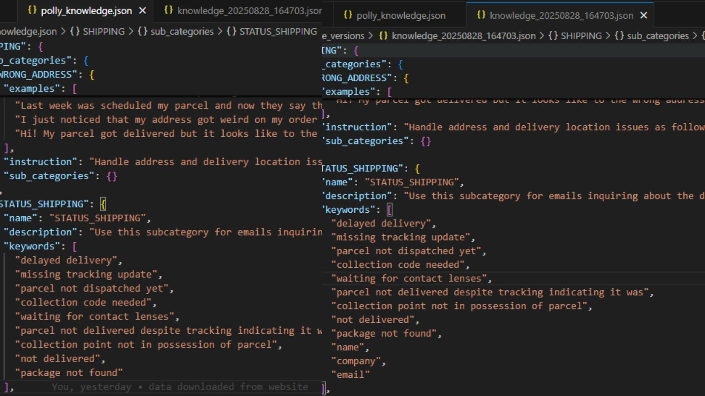

# Polly Optimization POC

(This project is only a proof of concept.  
The goal of this project is to explore how Polly’s knowledge tree could be optimized automatically.
The current implementation would not work well in production because the suggested keywords are just generic frequent words without deeper filtering or semantic understanding and  
the instruction suggestions are also very simple rule based checks.  
The point here is to show the pipeline and not a production ready solution!!)

## What the project does

- Loads the runs log and extracts data from it.
- Loads the knowledge tree json.
- Filters runs to English only (easier debugging)
- Evaluate performance before patch using Rouge-L value and Keyword Accuracy. Keyword accuracy is an additional metric I've made to measure how often the classification itself was correct.
- Suggests improvements with new keywords and instuction suggestions.
- Creates a patch that writes a new knowledge tree.
- Re-evaluates performance values comparing the original knowledge json file and the new "patch" json file.
- Output files are saved as a JSON patch file, an updated knowledge tree and a short report of what changes have been made and what values have changed with the new patch.

Example report output can be found in [last_run.md](last_run.md).

## Comparison

Knowledge tree json before and after running the poc.



---

## Setup

1. **Clone**
   ```bash
   git clone <your-repo-url>
   cd POLLY_OMPTIMIZATION_POC
   ```

2. **Set up a venv**
   ```bash
   python -m venv .venv
   .venv\Scripts\activate
   ```

3. **Install requirements**
   ```bash
   pip install -r requirements.txt
   ```

4. **Prepare files**  
   Place, polly_knowledge.json and polly_runs.json inside the data folder
---

## usage

```bash
python main.py
```
